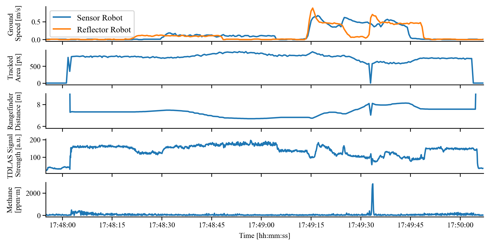

# gnss-visual-inter-robot-tracking
Software repository with exemplary files for GNSS/visual inter-robot tracking associated with the paper 'Combined GNSS/Visual Inter-Robot Tracking Method for Open-Path Gas Tomography'.

**If you use code from this repo or base your work on it**, we kindly ask you to include a citation to our paper 'Combined GNSS/Visual Inter-Robot Tracking Method for Open-Path Gas Tomography'. Detailed reference information along with the final version of the paper will be added to IEEE Xplore after publication. *TODO: add IEEE Xplore link after publication.* The accepted submitted (not final) version is available in conformance with IEEE policies [here](Lohrke_Sensors_2025_accepted_repo_copyright_notice.pdf).

Please consider this repo a proof-of-concept example. The code is experimental and comes with no warranty whatsoever.

In case of bugs, problems, or questions feel free to open an [issue](https://github.com/BAMresearch/gnss-visual-inter-robot-tracking/issues/new).

# Overview
The GNSS/visual inter-robot tracking method presented in the paper is a method to achieve tracking of a reflector robot by a sensor robot carrying the measuring equipment. In our case, the measuring robot carries a TDLAS methane sensor, and the reflector robot an illuminated target. Additionally, the method allows for lightweight synchronization. For details, please see the paper linked above. Below is an image of the measurement setup with both robots and a bag containing methane as a test source.

Some exemplary data acquired during the test run of the system is shown below.

For more details, see the paper linked above and the files in this repo.

# Files Overview
Note: some of these files integrate into a broader system which is out of the scope of this paper and will be published later. They are therefore not self-contained, directly-runnable implementations.
* `mavlink-router-pixhawk-lordv_1.conf`: configuration file for mavlink-router, sensor robot
* `mavlink-router-pixhawk-lordv_2.conf`: configuration file for mavlink-router, reflector robot
* `tracker.py`: python file containing the OpenCV tracking class `HueTracker` performing thresholding in the hue-saturation-value color space followed by contour detection
* `wait_next_multiple_seconds.lua`: synchronized waiting script for ArduPilot

